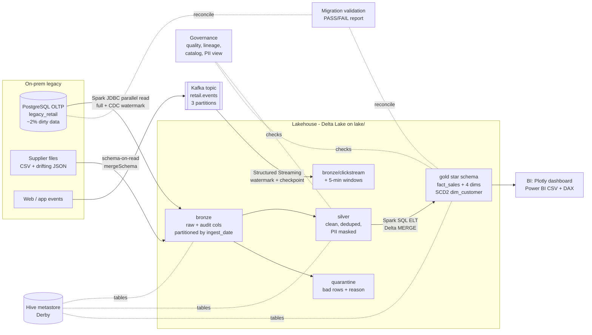
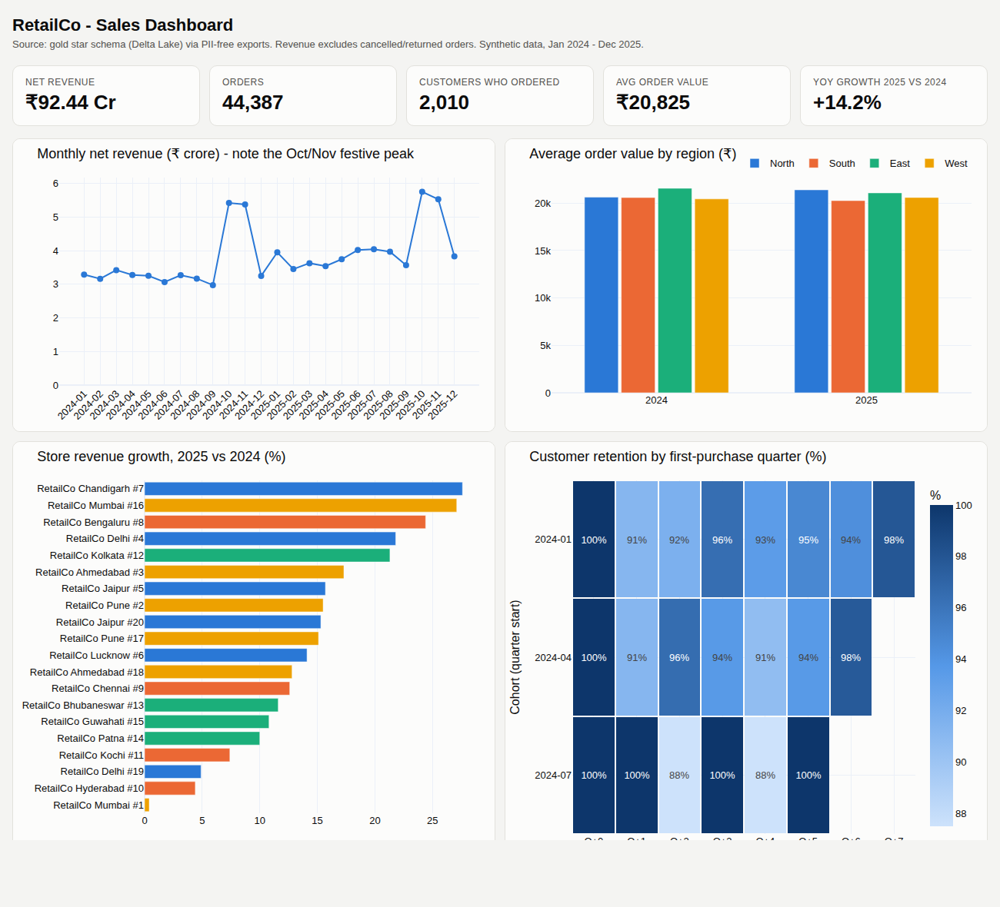

# RetailCo: legacy-to-lakehouse migration

**The story.** RetailCo, a 20-store Indian retail chain, runs its business on a 15-year-old on-prem
PostgreSQL OLTP database. Reports run straight on that database, it has no history, no constraints, and
messy data. This project modernises it into a **lakehouse**: the legacy tables are copied Sqoop-style with
parallel Spark JDBC reads (full load, then incremental CDC) into a **Delta Lake** bronze layer, cleaned and
PII-masked in silver (bad rows quarantined, never silently dropped), modelled as a **star schema with an SCD2
customer dimension** in gold using Spark SQL, governed with quality checks, lineage, a catalog and a PII-free
analyst view, **reconciled against the source** (counts, SHA-256 checksums, per-month revenue), and served to
BI (Plotly dashboard + Power BI guide). Real-time clickstream events flow through **Kafka** and Spark
Structured Streaming into the same lake. Everything runs locally with `make all`.

> New here? Read [`docs/LEARN.md`](docs/LEARN.md) (60-minute study guide) and
> [`docs/INTERVIEW.md`](docs/INTERVIEW.md) (pitch, walkthrough, real challenges).

## Architecture



## How to run

Prerequisites: Python 3.11, Java 17/21, PostgreSQL 16 (user `postgres` / password `postgres` on localhost),
Docker (only for streaming). Spark downloads the Delta, Postgres JDBC and Kafka connector jars from Maven Central
on first run.

```bash
make all          # setup venv -> legacy DB -> bronze -> Hive tables -> silver -> gold -> CDC round
                  #  -> quality/lineage/catalog -> migration validation -> analytics/exports/dashboard
                  #  -> MapReduce demo -> pytest
make clean        # delete everything generated
make stream       # Tier 2: Kafka (Docker, KRaft) + producer + Spark Structured Streaming (~1.5 min)
make scala        # Tier 2: Scala monthly revenue job (spark-shell bundled with PySpark)
make kafka-down   # stop Kafka
```

Individual steps: `make legacy ingest register silver gold cdc governance validate bi mapreduce test`.
Open `dashboard/index.html` in a browser (works offline).

## Results snapshot (real output of `make clean && make all` on a 4-core VM)

`make clean && make all` -> **exit 0, 9 min 07 s** (wall clock, includes venv check and pytest). Full log:
[`reports/make_all_output.txt`](reports/make_all_output.txt). The data is seeded, so counts are identical on every run.

**1. Legacy source (PostgreSQL)** - `customers 2,020 | products 200 | stores 20 | orders 50,400 | order_items 119,800`
(includes the injected duplicates and bad rows).

**2. Sqoop-style JDBC ingestion -> bronze, then CDC**

```
JDBC ingestion -> bronze   mode=FULL
  table        split col      readers  rows read  watermark(updated_at)
  customers    customer_id          2      2,020  2023-12-29 10:00:00
  orders       order_id             4     50,400  2025-12-31 22:02:00
  order_items  order_item_id        4    119,800  2025-12-31 22:02:00
...after `generate_legacy_db.py --apply-changes`:
JDBC ingestion -> bronze   mode=INCREMENTAL (CDC since last watermark)
  customers    customer_id          2         36  2026-10-01 08:49:41
  products     product_id           1         10  2026-10-01 08:49:41
  stores       store_id             1          0  2023-12-01 09:00:00
  orders       order_id             4        250  2026-10-01 08:49:41
  order_items  order_item_id        4        400  2026-10-01 08:49:41
```

**3. Hive metastore + schema drift** - 7 external tables registered in the Derby-backed Hive metastore
(`bronze.supplier_master type=EXTERNAL format=hive`, the rest `format=delta`). March supplier JSON adds
`batch_codes, temperature_c, transport`; `Without mergeSchema the append FAILS: AnalysisException`, with
`mergeSchema` it succeeds.

**4. Silver (after the CDC round)**

```
customers    bronze=  2,056  -dups/old versions=   46  -> silver=  2,010  quarantine=    0
products     bronze=    210  -dups/old versions=   10  -> silver=    199  quarantine=    1
orders       bronze= 50,650  -dups/old versions=  450  -> silver= 49,705  quarantine=  495
order_items  bronze=120,200  -dups/old versions=  600  -> silver=116,560  quarantine=3,040
Quarantine reasons: orders 243 missing customer_id | 150 unparseable order_date | 100 order_date in the future
                    order_items 1,193 parent order missing or quarantined | 1,016 non-positive quantity | 810 product missing or quarantined
```

**5. Gold star schema** - `dim_date 1,035 | dim_product 199 | dim_store 20 | dim_customer 2,033 | fact_sales 116,560`.
SCD2: 2,010 current versions + 23 historical versions (25 customers "moved"; 2 drew the city they already had,
so correctly no new version).

**6. Governance** - [`reports/data_quality.md`](reports/data_quality.md): **21/21 checks PASS** (completeness,
uniqueness, validity, referential integrity). Lineage: [`reports/lineage.md`](reports/lineage.md) +
`reports/lineage.json` (row counts and Delta versions per node). Catalog: [`docs/data_catalog.md`](docs/data_catalog.md).

**7. Migration validation** - [`reports/migration_validation.md`](reports/migration_validation.md): **OVERALL PASS (17/17)**

```
PASS  Row count (source vs bronze)                 orders       src=50,600             lake=50,600
PASS  SHA-256 checksum (all columns)               order_items  src=692502368888...    lake=692502368888...
PASS  Total amount qty x price                     order_items  src=1,089,641,141.17   lake=1,089,641,141.17
PASS  Row accounting: keys = silver + quarantine   order_items  src=119,600            lake=116,560 + 3,040
PASS  Per-month net revenue (all months)           fact_sales   src=1,029,432,964.78   lake=1,029,432,964.78
Delta time travel on gold.dim_customer:
  VERSION AS OF 0: CREATE TABLE  total=0      current=0
  VERSION AS OF 1: MERGE         total=2,000  current=2,000
  VERSION AS OF 2: MERGE         total=2,033  current=2,010
```

**8. Analytics & BI** - 5 queries -> `reports/analytics/*.csv`; exports `fact_sales.csv` 116,560 rows + 4 dims;
dashboard KPIs: **Net revenue ₹92.44 Cr | Orders 44,387 | Customers 2,010 | AOV ₹20,825 | YoY 2025 vs 2024 +14.2%**.
Top store growth: RetailCo Chandigarh #7 +27.6%. Festive peak: Oct 2024 ₹5.42 Cr vs ~₹3.2 Cr in a normal month.

**9. Tests** - `6 passed in 38.74s` (dedupe, email hashing, phone masking, legacy date parsing, quarantine, SCD2).

**MapReduce-style RDD job** (`make mapreduce`): `NORTH ₹278,642,926.02 | WEST ₹272,688,994.73 | EAST ₹189,686,986.74 | SOUTH ₹183,340,832.07`

**Kafka streaming** (`make stream`, real output in [`reports/streaming_demo_output.txt`](reports/streaming_demo_output.txt)):
producer sent 2,000 events/run at ~40 events/s; Spark wrote them to `lake/bronze/clickstream` with 5-minute windows,
e.g. `{08:30, 08:35} order_placed 589 events ₹57,97,630.78 275 customers`. A second run without the checkpoint
replayed the retained topic, giving 4,000 rows across partitions 0/1/2 (offsets 0-1431, 0-1283, 0-1283).

**Scala** (`make scala`, real output in [`reports/scala_output.txt`](reports/scala_output.txt)) - matches the SQL result exactly:

```
|year_month|revenue    |orders|
|2024-01   |32869699.63|1555  |
|2024-10   |54208020.19|2573  |
|2025-10   |57524179.13|2808  |
Year 2024: INR 429,301,656.22
Year 2025: INR 490,225,612.43
```



## JD skill -> where it is in this repo

| JD skill | Where to look | What it shows |
|---|---|---|
| Data Management | `src/generate_legacy_db.py`, `src/silver.py` | Legacy OLTP model, cleansing, dedupe, standardisation, quarantine |
| Data Warehousing | `sql/gold/*.sql`, `src/gold.py` | Star schema, declared grain, surrogate keys, SCD Type 2 via Delta `MERGE`, ELT in SQL |
| Data Governance | `src/quality_checks.py`, `src/lineage.py`, `docs/data_catalog.md`, `sql/gold/06_v_sales_analyst.sql` | 4 DQ dimensions, lineage JSON + Mermaid, catalog with PII flag + owner, PII masking, role-based view, DPDP notes |
| Data Lakes / Lakehouse | `src/common.py`, `lake/` layout, `src/validate_migration.py` (`time_travel`) | Medallion layers on Delta Lake, ACID, schema evolution, time travel |
| Hadoop | `docs/HADOOP_MAPPING.md`, `src/mapreduce_sales_by_region.py` | HDFS/YARN/MapReduce mapping, map + reduceByKey job |
| Hive | `src/register_tables.py`, `src/common.py` | Hive metastore (Derby), external tables, HiveQL `STORED AS TEXTFILE`, schema-on-read |
| Kafka | `docker-compose.yml`, `src/stream_producer.py`, `src/stream_consumer.py` | KRaft broker, keyed events, partitions/offsets, watermark, 5-min windows, checkpoints |
| Spark | every `src/*.py` | DataFrames, Spark SQL, window functions, JDBC, Structured Streaming, RDDs |
| Sqoop | `src/ingest_jdbc.py` | `partitionColumn/lowerBound/upperBound/numPartitions` = `--split-by/--num-mappers`; incremental CDC watermark |
| Scala | `scala/GoldRevenue.scala` | Monthly revenue in Scala, same result as SQL |
| GCP / Azure / AWS | `config/*.yaml`, `docs/CLOUD_MAPPING.md` | Env-only config switch (`s3a://`, `abfss://`, `gs://`), service mapping, Azure target diagram (not deployed) |
| Analytics & Visualization (Power BI/Tableau/Qlik) | `sql/analytics/`, `src/dashboard.py`, `dashboard/index.html`, `docs/POWERBI.md`, `exports/powerbi/` | 5 business queries (LAG, RANK, cohorts), Plotly dashboard, Power BI model + 3 DAX measures |
| Data migration & validation | `src/validate_migration.py`, `reports/migration_validation.md` | Counts, SHA-256 checksums, totals, row accounting, per-month reconciliation, cutover approach |
| Python | all of `src/`, `tests/` | PySpark, pandas, psycopg2, pytest |
| SQL | `sql/`, Postgres DDL | Window functions, CTEs, MERGE, views |
| Java | JVM stack | Spark/Hive/Kafka/JDBC run on Java 21; no hand-written Java code |
| C/C++ | - | Not demonstrated (see below) |

## Repository map

```
src/generate_legacy_db.py   legacy Postgres + dirty data + supplier files (+ --apply-changes)
src/ingest_jdbc.py          Sqoop-style parallel JDBC -> bronze, CDC watermark
src/register_tables.py      Hive metastore external tables, schema drift (mergeSchema)
src/silver.py               clean / dedupe / mask PII / quarantine
src/gold.py + sql/gold/     star schema ELT (SCD2 MERGE), PII-free analyst view
src/quality_checks.py       -> reports/data_quality.md
src/lineage.py              -> reports/lineage.json, reports/lineage.md, docs/data_catalog.md
src/validate_migration.py   -> reports/migration_validation.md (+ Delta time travel)
src/analytics.py + sql/analytics/   5 business queries -> reports/analytics/*.csv
src/export_bi.py            -> exports/powerbi/*.csv
src/dashboard.py            -> dashboard/index.html
src/mapreduce_sales_by_region.py    RDD map/reduceByKey
src/stream_producer.py / stream_consumer.py   Kafka + Structured Streaming
scala/GoldRevenue.scala     Scala aggregation
tests/                      pytest: dedupe, PII masking, date parsing, quarantine, SCD2
docs/                       LEARN, INTERVIEW, HADOOP_MAPPING, CLOUD_MAPPING, POWERBI, data_catalog
config/                     local / aws / azure / gcp + log4j2
```

## Not implemented / honest scope

- **Cloud deployment**: configs and the service mapping exist, nothing was deployed to AWS/Azure/GCP.
  Running there would also need the cloud storage connector jars (e.g. `hadoop-aws`) and credentials.
- **Real Hadoop cluster (HDFS/YARN)**: not installed; mapped in `docs/HADOOP_MAPPING.md`. Spark runs in local mode.
- **Sqoop**: not used (retired project); replaced by Spark JDBC with the same parallel/incremental mechanics.
- **Power BI `.pbix` / Tableau / Qlik**: no report file (no Power BI Desktop on Linux); the step-by-step guide,
  relationships, DAX and CSV model are provided, and the dashboard is a Plotly HTML page.
- **Enforced RBAC**: Spark local mode has no users; access control is illustrated with a PII-free view and the
  GRANT statements are documented.
- **Log-based CDC / deletes**: the watermark CDC does not capture hard deletes (explained in the code).
- **C/C++ and hand-written Java**: not part of this project.
- **Runtime target missed**: the brief asked for the batch pipeline in under 5 minutes; `make clean && make all` took
  **9 min 07 s** on this 4-core VM. The data is small (170k rows); most of the time is starting a new Spark JVM +
  Hive metastore for each of 13 Spark steps and Delta's per-commit overhead in local mode. A single-process runner
  (one SparkSession for all steps) would cut it, but was not built in the time box.
- Streaming (`make stream`) and Scala (`make scala`) are separate targets, not part of `make all`, because they
  need Docker / take extra time; their real outputs are in `reports/streaming_demo_output.txt` and
  `reports/scala_output.txt`.
