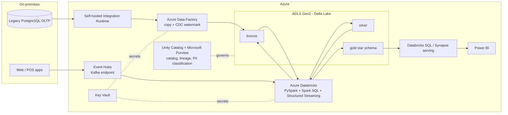

# Cloud mapping (designed, not deployed)

Everything here runs locally. The design is cloud-ready: **only `lake_root` and connection
strings change** between `config/local.yaml`, `aws.yaml`, `azure.yaml` and `gcp.yaml`
(choose with `RETAILCO_ENV=azure`). The PySpark/SQL code is the same.

| Component in this repo | Local (this project) | AWS | Azure | GCP |
|---|---|---|---|---|
| Legacy source DB | PostgreSQL 16 on the VM | RDS / on-prem via Direct Connect | Azure DB for PostgreSQL / on-prem via ExpressRoute | Cloud SQL / on-prem via Interconnect |
| Lake storage | `lake/` folder | **S3** (`s3a://`) | **ADLS Gen2** (`abfss://`) | **GCS** (`gs://`) |
| Table format | Delta Lake | Delta / Iceberg / Hudi | Delta (Databricks, Fabric OneLake) | Delta / Iceberg (BigLake) |
| Ingestion / ETL orchestration (`ingest_jdbc.py`, Makefile) | Spark JDBC + make | **Glue** jobs, DMS for CDC, Step Functions / MWAA | **Data Factory** (Copy activity, self-hosted IR) | **Dataflow** / Datastream for CDC, Cloud Composer |
| Spark compute | local[*] | **EMR** / Glue / Databricks | **Databricks** / Synapse Spark / Fabric | **Dataproc** / Dataproc Serverless |
| Warehouse / serving (gold) | Delta gold tables | **Redshift** (Spectrum) / Athena | **Synapse** SQL / Fabric Warehouse / Databricks SQL | **BigQuery** |
| Streaming (Kafka) | Docker Kafka (KRaft) | **MSK** / Kinesis | **Event Hubs** (Kafka endpoint) | **Pub/Sub** / Managed Kafka |
| Catalog + governance (metastore, lineage, catalog) | Derby Hive metastore, `lineage.py`, `data_catalog.md` | **Glue Data Catalog** + Lake Formation | **Purview** + Unity Catalog | **Dataplex** + Data Catalog |
| PII masking / RBAC (`v_sales_analyst`) | view + docs | Lake Formation column/row filters | Unity Catalog grants, Purview policies | BigQuery policy tags, authorized views |
| BI (dashboard, Power BI) | Plotly HTML, CSV exports | **QuickSight** | **Power BI** | **Looker** / Looker Studio |
| Secrets | plain YAML (demo) | Secrets Manager | Key Vault | Secret Manager |
| CI/CD | GitHub Actions | CodePipeline / GitHub Actions | Azure DevOps / GitHub Actions | Cloud Build / GitHub Actions |

## Target architecture on Azure (a common Deloitte client stack)

## Migration strategy fit (the "6 Rs")

This project is a **Re-platform / Re-architect** of the analytics side: data moves from an on-prem OLTP
database (used for reporting today) to a lakehouse. The OLTP app itself would typically be **Rehosted**
or **Re-platformed** (e.g. PostgreSQL -> Azure Database for PostgreSQL) in a separate track.
