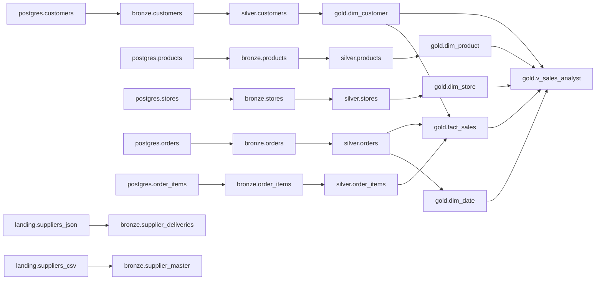

# Lineage

_Generated by `src/lineage.py`. Full graph with row counts and Delta versions: `reports/lineage.json`._

```mermaid
flowchart LR
    postgres_customers[postgres.customers] --> bronze_customers[bronze.customers]
    postgres_products[postgres.products] --> bronze_products[bronze.products]
    postgres_stores[postgres.stores] --> bronze_stores[bronze.stores]
    postgres_orders[postgres.orders] --> bronze_orders[bronze.orders]
    postgres_order_items[postgres.order_items] --> bronze_order_items[bronze.order_items]
    landing_suppliers_json[landing.suppliers_json] --> bronze_supplier_deliveries[bronze.supplier_deliveries]
    landing_suppliers_csv[landing.suppliers_csv] --> bronze_supplier_master[bronze.supplier_master]
    bronze_customers[bronze.customers] --> silver_customers[silver.customers]
    bronze_products[bronze.products] --> silver_products[silver.products]
    bronze_stores[bronze.stores] --> silver_stores[silver.stores]
    bronze_orders[bronze.orders] --> silver_orders[silver.orders]
    bronze_order_items[bronze.order_items] --> silver_order_items[silver.order_items]
    silver_orders[silver.orders] --> gold_dim_date[gold.dim_date]
    silver_products[silver.products] --> gold_dim_product[gold.dim_product]
    silver_stores[silver.stores] --> gold_dim_store[gold.dim_store]
    silver_customers[silver.customers] --> gold_dim_customer[gold.dim_customer]
    gold_dim_customer[gold.dim_customer] --> gold_fact_sales[gold.fact_sales]
    silver_order_items[silver.order_items] --> gold_fact_sales[gold.fact_sales]
    silver_orders[silver.orders] --> gold_fact_sales[gold.fact_sales]
    gold_dim_customer[gold.dim_customer] --> gold_v_sales_analyst[gold.v_sales_analyst]
    gold_dim_date[gold.dim_date] --> gold_v_sales_analyst[gold.v_sales_analyst]
    gold_dim_product[gold.dim_product] --> gold_v_sales_analyst[gold.v_sales_analyst]
    gold_dim_store[gold.dim_store] --> gold_v_sales_analyst[gold.v_sales_analyst]
    gold_fact_sales[gold.fact_sales] --> gold_v_sales_analyst[gold.v_sales_analyst]
```
